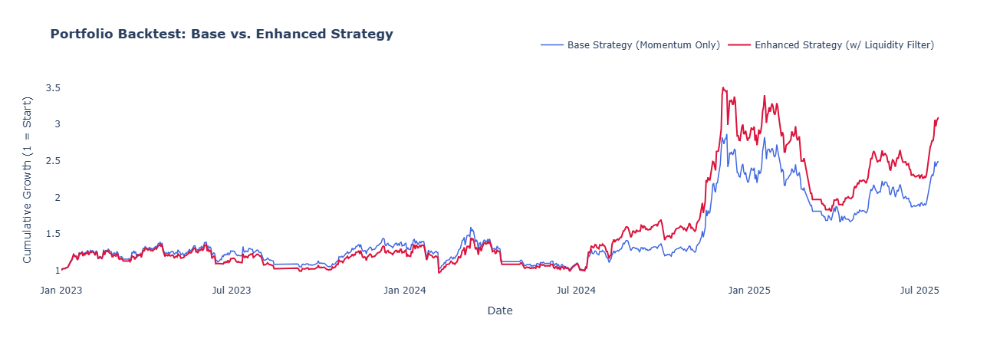
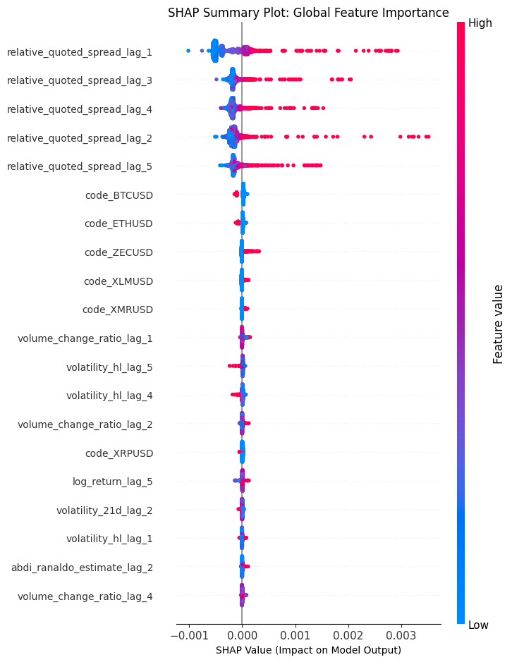

# Project "Liquidity Edge"

### A Quantitative Approach to Forecasting Transaction Costs and Managing Risk in Crypto Markets

**Tags:** `Quantitative Finance`, `Machine Learning`, `Python`, `Panel Data`, `Time Series Forecasting`, `Portfolio Management`, `Risk Management`

---

## Executive Summary
Transaction costs, particularly in volatile markets like cryptocurrency, are a major determinant of portfolio performance. This project develops a unified machine learning model to forecast next-day transaction costs (as measured by the relative bid-ask spread) for a diverse portfolio of 8 cryptocurrencies.

The core innovation is the use of **Principal Component Analysis (PCA)** on multiple microstructure estimators to engineer robust, proprietary risk factors. These factors, combined with standard market data, are used to train a LightGBM model.

The model's predictions are then deployed as a **liquidity filter** on a baseline momentum strategy. The final backtest demonstrates that this data-driven approach to managing transaction costs adds significant value, resulting in a **20.4% improvement in the Sharpe Ratio** and a **40% increase in total returns** compared to the unfiltered strategy.

---

## Key Visual: Backtest Performance
The chart below shows the cumulative growth of a $1 investment in the baseline momentum strategy versus the enhanced strategy that uses our model's liquidity filter. The enhanced strategy demonstrates superior risk-adjusted performance and overall profitability.



---

## The Core Idea & Problem Statement
Academic estimators of transaction costs, like Corwin-Schultz and Abdi-Ranaldo, are valuable but often produce noisy and conflicting signals. A key challenge in quantitative finance is determining which signal to trust.

This project reframes this problem as an opportunity. Instead of viewing the **divergence between estimators as noise, we treat it as a signal in itself**—an indicator of unusual market dynamics and heightened information asymmetry.

By applying PCA to these estimators on a per-asset basis, we decompose their behavior into two new, more meaningful factors:
1.  **The "Consensus Stress Factor" (PC1):** A robust measure of overall market stress when both estimators agree.
2.  **The "Model Disagreement Factor" (PC2):** A unique signal of unusual market regimes where the estimators diverge.

These engineered factors serve as powerful features for a machine learning model tasked with predicting the *actual, ground-truth* bid-ask spread.

---

## Methodology / Workflow
This project follows a rigorous, end-to-end quantitative research process:

1.  **Data Preparation & Feature Engineering:**
    *   Consolidated daily bid/ask and OHLCV data for 8 coins into a unified **panel dataset**.
    *   Calculated the ground-truth target variable: the **Relative Quoted Spread**.
    *   Engineered two sets of features:
        *   **Standard Market Features:** Lagged log returns, volatility, and volume metrics.
        *   **Proprietary Microstructure Factors:** Applied **PCA** on the Corwin-Schultz and Abdi-Ranaldo estimators on a per-coin basis to create the `pc1_stress_factor` and `pc2_disagreement_factor`.

2.  **Model Training & Interpretation:**
    *   Trained a single, unified **LightGBM** model on the entire panel dataset, using one-hot encoding for coin identities.
    *   Employed a chronological train-test split and early stopping to ensure robustness and prevent overfitting.
    *   Interpreted the final model using **SHAP** to identify the key drivers of transaction costs.

3.  **Validation & Backtesting:**
    *   Validated the model's statistical accuracy (R² of 53.55%) and its economic signal (proving 'High Cost' predictions correspond to significantly higher real-world spreads).
    *   Designed and executed a daily rebalanced portfolio backtest comparing a **Base Momentum Strategy** against an **Enhanced Strategy** that incorporated our model's predictions as an entry filter.

---

## Key Results & Analysis

### 1. Statistical Performance
The model demonstrated strong predictive power on the unseen test set.
*   **R-squared:** 0.5355 (The model explains over 53% of the variance in next-day transaction costs).
*   **SHAP Analysis:** The most important predictors were the recent history of the spread itself (persistence), asset-specific identities (the "Bitcoin effect"), and market dynamics like volatility.



### 2. Economic Signal Validation
We proved that the model's predictions are economically meaningful. On days our model flagged as 'High Cost', the average *actual* spread was **55% higher** than on 'Normal Cost' days. A Welch's t-test confirmed this difference is statistically significant (p-value ≈ 0).

### 3. Backtest Performance
The final backtest provided definitive proof of the model's economic value.

| Strategy | Total Cumulative Return | Annualized Sharpe Ratio | Maximum Drawdown | Annualized Turnover |
| :--- | :--- | :--- | :--- | :--- |
| **Base Strategy (Momentum Only)** | 149.19% | 0.59 | -42.04% | 3520% |
| **Enhanced Strategy (w/ Filter)** | **210.00%** | **0.71** | -48.29% | 6087% |

The Enhanced Strategy, guided by our model, achieved a **20.4% improvement in its Sharpe Ratio**, demonstrating vastly superior risk-adjusted returns.

### A Note on Portfolio Turnover
The higher turnover in the Enhanced Strategy is a realistic outcome, resulting from the high-frequency nature of the liquidity signal. The key finding is that the economic value of the filter was so significant that it overwhelmingly compensated for the implicit costs of more frequent trading, leading to superior performance.

---

## Tech Stack & Project Structure
*   **Language:** Python
*   **Dependency Management:** `uv` & `pyproject.toml`
*   **Core Libraries:** Pandas, NumPy, Scikit-learn, LightGBM, SHAP
*   **Visualization:** Plotly, Matplotlib
*   **Project Structure:** Modular source code in `src/` with the main analysis narrative in `notebooks/`.

### Repository Structure
```
.
├── data/
│   ├── BITFINEX_DATA.csv
│   ├── final_model_df.csv
│   └── panel_df.csv
├── model/
├── notebooks/
│   ├── 01_data_preparation_and_feature_engineering.ipynb
│   └── 02_model_training_and_evaluation.ipynb
├── plots/
├── src/
│   ├── __init__.py
│   ├── logger.py
│   └── backtesting.py
├── .gitignore
├── .python-version
├── pyproject.toml
├── uv.lock
└── README.md
```

---

## How to Run This Project

This project uses `uv` for fast and reliable dependency management.

1.  **Clone the repository:**
    ```bash
    git clone https://github.com/PetrosChol/liquidity-edge.git
    cd your-repo-name
    ```

2.  **Install the required dependencies:**
    `uv` will install all dependencies specified in `pyproject.toml` and locked in `uv.lock`.
    ```bash
    uv sync
    ```

3.  **Run the Jupyter Notebooks in order:**
    *   First, open and run all cells in `notebooks/01_data_preparation_and_feature_engineering.ipynb`. This will process the raw data and generate the necessary intermediate files (`panel_df.csv` and `final_model_df.csv`).
    *   Next, open and run all cells in `notebooks/02_model_training_and_evaluation.ipynb`. This will train the model, perform the analysis, and produce the final backtest results.

    *Note: The notebooks import custom logic from the `src/` directory, which contains reusable functions for backtesting and other core tasks. This modular design separates the analysis narrative from the underlying implementation.*